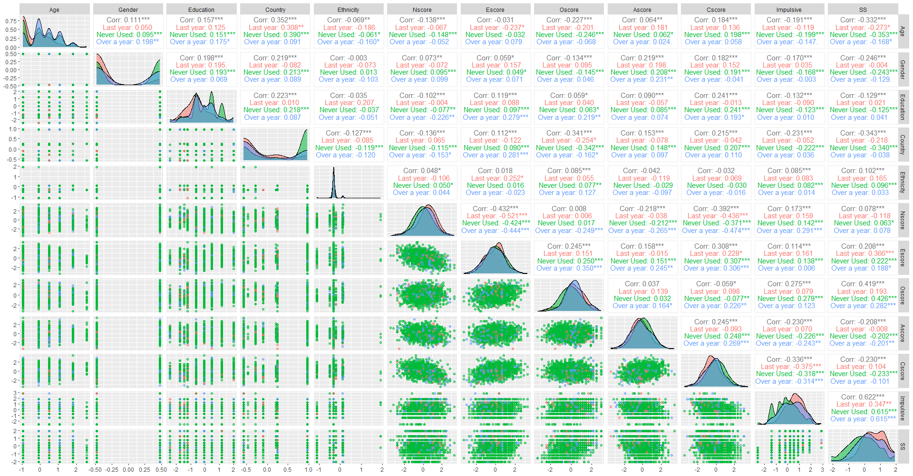
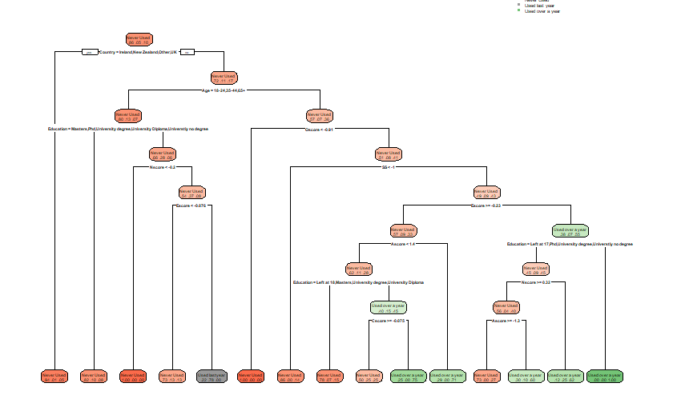
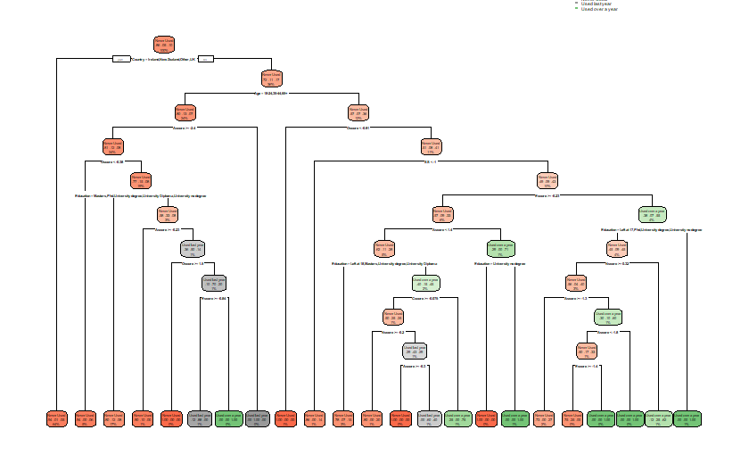
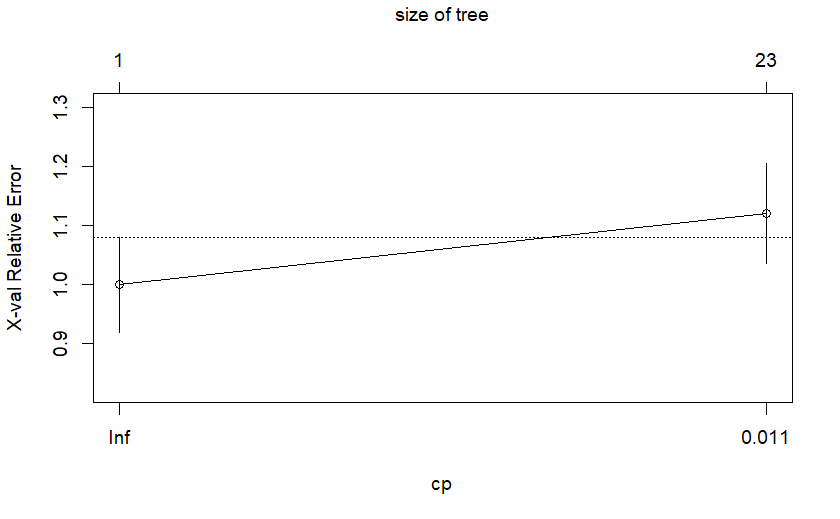

```{r, include=FALSE}
knitr::opts_chunk$set(echo = FALSE, warning = FALSE)
```

```{r packages, echo=FALSE, warning=FALSE, include=FALSE}
library(readr)
library(dplyr)
library(ggplot2)
library(ggpubr)
library(reshape2) 
library(rpart)
library(rpart.plot)
library(cowplot)
library(gridExtra)
library(GGally)
library(skimr)
library(tibble)
library(randomForest)
library(caret)
library(MASS)
library(e1071)
library(kableExtra)
```
\newpage
# Introduction
What affects drug consumption? Given 12 attributes from over 1800 participants and using data mining techniques this is the question that will be investigated. The variables that have been recorded are divided into two; personality measurements, which include NEO-FFI-R (neuroticism, extraversion, openness to experience, agreeableness, and conscientiousness), BIS-11 (impulsivity), and ImpSS (sensation seeking), and demographic variables which includes, level of education, age, gender, country of residence and ethnicity. All the demographic variables were recorded as categorical and have been quantified for the analysis.

The investigation will focus on the use of one drug, crack, divided into three categories; Never used, Used over a year ago and Used in the last year. 

This report has been divided into parts, summaries, which include plots of the distributions of the variables, formal analysis, results, and conclusion.
```{r dataset, echo=FALSE, include=FALSE}
group_29 <- read_csv("https://raw.githubusercontent.com/martacasero7/Group_29_Data_Mining/main/group_29.csv")

group_29 <- group_29 %>% filter(Semer == "CL0") #Semer is a fake drug so people who have said they have taken it have unreliable responses
group_29 <- na.omit(group_29)
group_29$Crack <- as.factor(group_29$Crack)
 
levels(group_29$Crack)

group_29$Crack <- ifelse(group_29$Crack == "CL0", "Never Used",
                          ifelse(group_29$Crack %in% c("CL1", "CL2"), "Used over a year",
                                 "Used last year"))

group_29$Crack <- as.factor(group_29$Crack)

levels(group_29$Crack)
summary(group_29$Crack)

group_29_ <- group_29 %>% mutate(Age = ifelse(Age=="-0.95197", "18-24",
                                 ifelse(Age=="-0.07854", "25-34",
                                 ifelse(Age=="0.49788", "35-44", 
                                 ifelse(Age=="1.09449", "45-54",
                                 ifelse(Age=="1.82213", "55-64", "65+"))))))

group_29_ <- group_29_ %>% mutate(Gender = ifelse(Gender=="0.48246", "Female", "Male"))

group_29_ <- group_29_ %>% mutate(Education = ifelse(Education==" -2.43591", "Left before 16",
                                              ifelse(Education=="-1.73790", "Left at 16",
                                              ifelse(Education=="-1.43719", "Left at 17", 
                                              ifelse(Education=="-1.22751", "Left at 18",
                                              ifelse(Education=="-0.61113", "Universtiy no degree", 
                                              ifelse(Education=="-0.05921", "University Diploma",
                                              ifelse(Education=="0.45468", "University degree",
                                              ifelse(Education=="1.16365", "Masters", "Phd")))))))))

group_29_ <- group_29_ %>% mutate(Country = ifelse(Country=="-0.09765", "Australia",
                                       ifelse(Country==" 0.24923", "Canada",
                                       ifelse(Country=="-0.46841", "New Zealand", 
                                       ifelse(Country=="-0.28519", "Other",
                                       ifelse(Country=="0.21128", "Ireland",
                                       ifelse(Country=="0.96082", "UK", "USA")))))))

group_29_ <- group_29_ %>% mutate(Ethnicity = ifelse(Ethnicity=="-0.50212", "Asian",
                                            ifelse(Ethnicity=="-1.10702", "Black",
                                            ifelse(Ethnicity=="1.90725", "Mixed Black/Asian", 
                                            ifelse(Ethnicity=="0.12600", "Mixed White/Asian",
                                            ifelse(Ethnicity=="-0.22166", "Mixed White/Black",
                                            ifelse(Ethnicity=="-0.31685", "White", "Other")))))))
```
# Summaries

```{r summaries, fig.ncol = 2, fig.asp=0.7, fig.align = "center", fig.cap='Summaries', fig.subcap=c(' Relationship between crack use and age', 'Relationship between crack use and gender', 'Relationship between crack use and education', 'Relationship between crack use and country', 'Relationship between crack use and ethnicity', 'Boxplots of personality measurements per use of drug')}
age_hist <- ggplot(data = group_29_, aes(x=as.factor(Age), group = Crack)) +
  geom_bar(aes(y = ..prop.., fill= Crack), stat="count", position="dodge") +
  scale_fill_manual(values =  c("salmon", "grey", "darkseagreen")) +
  labs(x= "", y="Proportion") +
  theme(axis.text.x=element_text(angle=45, hjust=1))

age <- as.data.frame(table(group_29_$Age))
colnames(age) <- c("Age", "Value")
age$Age <- as.factor(age$Age)

age_piechart <- ggplot(data = age, aes(x="",y=Value, fill=Age))+
  geom_col(width = 1, col = "white") +
  coord_polar(theta = "y") +
  theme_void()

grid.arrange(age_hist, age_piechart, ncol =2,  widths = c(1, 0.5))

gender_hist <- ggplot(data = group_29_, aes(x=as.factor(Gender), group = Crack)) +
  geom_bar(aes(y = ..prop.., fill= Crack), stat="count", position="dodge") +
  scale_fill_manual(values =  c("salmon", "grey", "darkseagreen")) +
  labs(x= "", y="Proportion") 

gender <- as.data.frame(table(group_29_$Gender))
colnames(gender) <- c("Gender", "Value")
gender$Gender <- as.factor(gender$Gender)

gender_piechart <- ggplot(data = gender, aes(x="",y=Value, fill=Gender))+
  geom_col(width = 1, col = "white") +
  coord_polar(theta = "y") +
  theme_void()

grid.arrange(gender_hist, gender_piechart, ncol =2,  widths = c(1, 0.5))


edu_hist <- ggplot(data = group_29_, aes(x=as.factor(Education), group = Crack)) +
  geom_bar(aes(y = ..prop.., fill= Crack), stat="count", position="dodge") +
  scale_fill_manual(values =  c("salmon", "grey", "darkseagreen")) +
  labs(x= "", y="Proportion") +
  theme(axis.text.x=element_text(angle=45, hjust=1))

edu <- as.data.frame(table(group_29_$Education))
colnames(edu) <- c("Education", "Value")
edu$Education <- as.factor(edu$Education)

edu_piechart <- ggplot(data = edu, aes(x="",y=Value, fill=Education))+
  geom_col(width = 1, col = "white") +
  coord_polar(theta = "y") +
  theme_void() 

grid.arrange(edu_hist, edu_piechart, ncol =2,  widths = c(1, 0.7))


country_hist <- ggplot(data = group_29_, aes(x=as.factor(Country), group = Crack)) +
  geom_bar(aes(y = ..prop.., fill= Crack), stat="count", position="dodge") +
  scale_fill_manual(values =  c("salmon", "grey", "darkseagreen")) +
  labs(x= "", y="Proportion") +
  theme(axis.text.x=element_text(angle=45, hjust=1))

country <- as.data.frame(table(group_29_$Country))
colnames(country) <- c("Country", "Value")
country$Country <- as.factor(country$Country)

country_piechart <- ggplot(data = country, aes(x="",y=Value, fill=Country))+
  geom_col(width = 1, col = "white") +
  coord_polar(theta = "y") +
  theme_void() 

grid.arrange(country_hist, country_piechart, ncol =2,  widths = c(1, 0.6))


eth_hist <- ggplot(data = group_29_, aes(x=as.factor(Ethnicity), group = Crack)) +
  geom_bar(aes(y = ..prop.., fill= Crack), stat="count", position="dodge") +
  scale_fill_manual(values =  c("salmon", "grey", "darkseagreen")) +
  labs(x= "", y="Proportion") +
  theme(axis.text.x=element_text(angle=45, hjust=1))

eth <- as.data.frame(table(group_29_$Ethnicity))
colnames(eth) <- c("Ethnicity", "Value")
eth$Ethnicity <- as.factor(eth$Ethnicity)

eth_piechart <- ggplot(data = eth, aes(x="",y=Value, fill=Ethnicity))+
  geom_col(width = 1, col = "white") +
  coord_polar(theta = "y") +
  theme_void()

grid.arrange(eth_hist, eth_piechart, ncol =2,  widths = c(1, 0.5))

crack <- group_29_ %>% dplyr::select(!c("ID", "Age", "Gender", "Education", "Country", "Ethnicity", "Semer")) %>% melt(id="Crack")
crack$value <- as.numeric(crack$value)
ggplot(crack, aes(x = variable, y=value)) + 
  geom_boxplot(aes(fill= Crack)) + 
  scale_fill_manual(values =  c("salmon", "grey", "darkseagreen")) +
  labs(x="", y="Grade") +
  ggpubr::rotate_x_text()
```


```{r exploratory, echo=FALSE, include=FALSE, eval = TRUE, warning=FALSE, fig.align = "center", fig.cap = "\\label{fig:corr} Correlation Matrix", fig.asp=0.7, fig.pos = "H"}
skim <- skim(group_29)
pairs <- ggpairs(group_29, columns=2:13, ggplot2::aes(colour=Crack, alpha=0.2))
#image created downloaded into directory and added as an image instead
```

```{r split, echo=FALSE, warning=FALSE}
n <- nrow(group_29) #sample size
m <- ncol(group_29)
ind1 <- sample(c(1:n),        floor(0.5 * n)) 
ind2 <- sample(c(1:n)[-ind1], floor(0.25 * n))
ind3 <- setdiff(c(1:n),c(ind1,ind2))

train.data <- group_29[ind1, ]
valid.data <- group_29[ind2, ]
test.data  <- group_29[ind3, ]

train.data <- train.data[, -c((m-2):(m-1))]
valid.data <- valid.data[, -c((m-2):(m-1))]
test.data <-   test.data[, -c((m-2):(m-1))]

```
# Formal Analysis
## K-nearest neighbours

*k*-Nearest Neighbours (kNN) is a nonparametric classification method. This means that we do not have to assume a parametric model for the data or the classes, and thus don’t have to worry about diagnostic tests for normality or the like
```{r knn, echo=FALSE, warning=FALSE}
var.mean <- apply(train.data[,2:12],2,mean) #calculate mean of each feature
var.sd   <- apply(train.data[,2:12],2,sd)   #calculate standard deviation of each feature

# standardise training, validation and test sets
train.data.scale <-t(apply(train.data[,2:12], 1, function(x) (x-var.mean)/var.sd))
valid.data.scale <-t(apply(valid.data[,2:12], 1, function(x) (x-var.mean)/var.sd))
test.data.scale  <-t(apply(test.data[,2:12],  1, function(x) (x-var.mean)/var.sd))

library(class)
K <- c(1:25)
valid.error <- c()
for (k in K){
  valid.pred <- knn(train.data.scale, valid.data.scale, train.data[,13, drop=TRUE], k=k)
  valid.error[k] <- mean(valid.data[,13, drop=TRUE] != valid.pred)
}
```
The minimum valid error given by R is 14, this agrees with the plot in *Figure ?*

```{r knnplot, echo=FALSE, include=FALSE, eval = TRUE, warning=FALSE, fig.align = "center", fig.cap = "\\label{fig:knnp} KNN valid error", fig.asp=0.5, fig.pos = "H"}
plot(K, valid.error, type="b", ylab="validation error rate")
```
Given both the minimum valid error and the plot in \ref{knnp}, the optimal value for the kNN prediction is 14.
```{r knn2, echo=FALSE, warning=FALSE}
k.opt <- which.min(valid.error)
test.pred <- knn(train.data.scale, test.data.scale, train.data[,13, drop=TRUE], k=14)
knn <- table(test.data$Crack,test.pred)
kable(knn,
      caption = "Prediction table form the knn method") %>%
  kable_styling(latex_options = "HOLD_position", full_width = F)
```
## Tree method
```{r treedata, echo=FALSE, warning=FALSE, include=FALSE}
set.seed(1)
n <- nrow(group_29_) #sample size
ind1 <- sample(c(1:n),        floor(0.5 * n)) 
ind2 <- sample(c(1:n)[-ind1], floor(0.25 * n))
ind3 <- setdiff(c(1:n),c(ind1,ind2))

group_29_$Age <- as.factor(group_29_$Age)
group_29_$Gender <- as.factor(group_29_$Gender)
group_29_$Education <- as.factor(group_29_$Education)
group_29_$Country <- as.factor(group_29_$Country)
group_29_$Ethnicity <- as.factor(group_29_$Ethnicity)

train.tree <- group_29_[ind1, c(2,3,4,5,6,7,8,9,10,11,12,13,15)]
valid.tree <- group_29_[ind2, c(2,3,4,5,6,7,8,9,10,11,12,13,15)]
test.tree  <- group_29_[ind3, c(2,3,4,5,6,7,8,9,10,11,12,13,15)]
```

```{r tree, echo=FALSE, warning=FALSE, include=FALSE}
tree.crack <- rpart(Crack~., data=train.tree, method="class")
rpart.plot(tree.crack, type=2, extra=4) 

plotcp(tree.crack)
```
 & 

```{r tree2, echo=FALSE}
pred <- predict(tree.crack, train.tree, type="class")
pred_m <- confusionMatrix(pred, train.tree$Crack, positive='y')

pred1 <- predict(tree.crack, valid.tree, type = 'class')
val <- confusionMatrix(pred1, valid.tree$Crack, positive='y')

pred2 <- predict(tree.crack, test.tree, type = 'class')
test <- confusionMatrix(pred2, test.tree$Crack, positive='y')

tree_accuracy <- test$overall["Accuracy"]

tree_table <- test$table

test_class <- test$byClass
```

```{r tree_table, echo=FALSE}
kable(tree_table,
      caption = "Prediction table form the tree") %>%
  kable_styling(latex_options = "HOLD_position", full_width = F)

```
Given the results on *Table ?* the accuracy of this tree is 0.8765957.

```{r tree_class, echo=FALSE}
kable(test_class, 
      caption = "Table form the full pruned tree") %>%
  kable_styling(latex_options = "HOLD_position", full_width = F)
```
 & 
```{r fulltree, echo=FALSE}
#full tree and prune
Full_tree <- rpart(Crack~Age+Gender+Education+Country+Ethnicity+Nscore+Escore+Oscore+Ascore+Cscore+Impulsive+SS, data=train.tree, method="class", 
                   control=rpart.control(minsplit=2,minbucket=1,maxdepth=30,cp=-1))
pruned_tree <- prune(Full_tree, cp=0.01)
prune_tree <- rpart.plot(pruned_tree, box.palette = "auto")

prune_cp <- plotcp(pruned_tree)

prune_pred <- predict(pruned_tree, train.tree, type="class")
pred_m2 <- confusionMatrix(prune_pred, train.tree$Crack, positive='y')

prune_pred1 <- predict(pruned_tree, valid.tree, type = 'class')
val2 <- confusionMatrix(prune_pred1, valid.tree$Crack, positive='y')

prune_pred2 <- predict(pruned_tree, test.tree, type = 'class')
test2 <- confusionMatrix(prune_pred2, test.tree$Crack, positive='y')

tree_accuracy2 <- test$overall["Accuracy"]

tree_table2 <- test$table

test_class2 <- test$byClass
```

```{r tree_table2, echo=FALSE}
kable(tree_table2,
      caption = "Prediction table form the full pruned tree") %>%
  kable_styling(latex_options = "HOLD_position", full_width = F)
```
The accuracy given by the full pruned tree on *Figure ?* is 0.8702128 
```{r tree_class2, echo=FALSE}
kable(test_class2, 
      caption = "Table form the full pruned tree") %>%
  kable_styling(latex_options = "HOLD_position", full_width = F)
```
\newpage
## Linear and quadratic discriminant analysis
Linear Discriminant Analysis (LDA) is a statistical technique that seeks to find a linear combination of features or variables that best separates two or more classes or groups of data. The goal of LDA is to project the original data into a lower-dimensional space while preserving the class-discriminatory information.

In other words, LDA seeks to find a linear boundary or decision surface that best separates the classes, and accomplishes this by maximizing the between-class variance and minimizing the within-class variance. This also means that the use of LDA requires the variables to have a certain distribution and variance. To be more exact, we'll assume the group of variables follow a multivariate Gaussian distribution, and have a equal covariance matrix.

Quadratic Discriminant Analysis (QDA) is a statistical technique that is similar to LDA. However, unlike LDA, QDA allows for non-linear decision boundaries. And the variance and covariance of the predictor variables are allowed to differ between classes, resulting in a separate covariance matrix for each class.

To apply LDA (and QDA), we first assume that the observations in dataset follow a multivariate Gaussian
distribution, which is more restrictive. 

Also, we'll mainly consider in two different cases, the equal covariance matrix case, and the case in which the class-covariance matrices are not assumed to be equal. The former case will apply LDA, and for later will apply QDA. 

We can see from the chart on *Figure 2* that the variable from Nscore to Cscore nearly follow the Gaussian distribution and Impulsive and SS roughly follow it. However, other variables are numerical variables transformed from categorical variables, and obviously don't follow Gaussian distribution. So two group of analysis will be made to see whether LDA method works well on this set of data.(the whole variable one and the only "personality measurements" one.)
```{r checkcov, echo = FALSE, eval = TRUE, warning = FALSE, message = FALSE, include=FALSE}
for (i in 2:13) {
  cat(colnames(group_29)[i],sep="\n")
  print(aggregate(group_29[,i],by=list(group_29$Crack),var)) #compute variance for each group
}
```
\begin{table}[ht!]
\centering
\begin{tabular}{llll}
          & Never Used & Used last year & Used over a year \\
Age       & 0.7916112  & 0.5516475      & 0.5871009        \\
Gender    & 0.2324265  & 0.1214834      & 0.2304400        \\
Education & 0.8861081  & 0.7309267      & 0.9513266        \\
Country   & 0.4655506  & 0.3061925      & 0.4727129        \\
Ethnicity & 0.02923015 & 0.02214670     & 0.01466972       \\
Nscore    & 0.9815622  & 1.0404769      & 1.0021583        \\
Escore    & 0.9967044  & 0.8147390      & 1.0322663        \\
Oscore    & 1.0027928  & 0.9626822      & 0.7488011        \\
Ascore    & 0.9591215  & 1.0782256      & 1.1928083        \\
Cscore    & 0.9761778  & 0.8317643      & 1.0683572        \\
Impulsive & 0.8943052  & 0.5818817      & 0.8601190        \\
SS        & 0.9191740  & 0.5898128      & 0.7698302       
\end{tabular}
\caption{Variance of the explanatory variables}
\label{tab:my-table}
\end{table}

It seems that only Nscore and Ascore have similar variance. Although the variance and covariance show that LDA might not well satisfied to LDA, but we'll a least have a try and make some visualization. 
```{r split2, echo = FALSE, eval = TRUE, warning = FALSE, message = FALSE, include=FALSE}
set.seed(1)
n <- nrow(group_29) #sample size


ind <- sample(c(1:n), floor(0.8*n))

train.data1 <- group_29[ind,-c(1,14)]
test.data1  <- group_29[-ind,-c(1,14)]

train.data2 <- group_29[ind,-c(1:6,14)]
test.data2  <- group_29[-ind,-c(1:6,14)]
```

```{r lda1, echo = FALSE, eval = TRUE, warning = FALSE, message = FALSE}
lda.data1 <- lda(Crack~., data=train.data1)

table(Actual=(actual<-train.data1$Crack),
       Predicted=(classified<-predict(lda.data1)$class))
```
The density plot for each of the drug use factors has been plotted on the same axis to see the overlap between them.
```{r lda1_plot1, echo=FALSE, include=FALSE, eval = TRUE, warning=FALSE, fig.align = "center", fig.cap = "\\label{fig:corr} Linear discriminant analysis", fig.asp=0.7, fig.pos = "H"}
data.pred.tr1 <- predict((lda.data1))
densityplot <- ldahist(data = data.pred.tr1$x[,1], g=train.data1$Crack)

dataset1 <- data.frame(Type=train.data1$Crack, lda=data.pred.tr1$x)
ggplot(dataset1, aes(x=lda.LD1)) + 
  geom_density(aes(group=Type, colour=Type, fill=Type), alpha=0.3)+
  labs(x= "", y="Density")
```

```{r lda, echo = FALSE, eval = TRUE, warning = FALSE, message = FALSE}
lda.data2 <- lda(Crack~.,data=train.data2)

table( Actual=(actual<-train.data2$Crack),
       Predicted=(classified<-predict(lda.data2)$class) )
```
```{lda_plot2, echo=FALSE, include=FALSE, eval = TRUE, warning=FALSE, fig.align = "center", fig.cap = "\\label{fig:corr} Linear discriminant analysis", fig.asp=0.7, fig.pos = "H"}
data.pred.tr2 <- predict((lda.data2))
ldahist(data = data.pred.tr2$x[,1], g=train.data2$Crack)

dataset <- data.frame(Type=train.data2$Crack, lda=data.pred.tr2$x)
ggplot(dataset, aes(x=lda.LD1)) + 
  geom_density(aes(group=Type, colour=Type, fill=Type), alpha=0.3)+
  labs(x= "", y="Density")
```

For both of the analysis performed it is shown on the plots that the LDA does not work properly as they overlap, this implies that LDA does not manage to difference between the 3 factors established.

```{r qda1, echo = FALSE, eval = TRUE, warning = FALSE, message = FALSE}
qda.data1 <- qda(Crack~., data=train.data1)
data.pred.te21 <- predict(qda.data1, test.data1)

#mean(train.data$Crack != data.pred.te2$class)

table(actual<-train.data1$Crack, 
      Predicted<-predict(qda.data1)$class)

mean(is_miss <- actual != Predicted)
```

```{r qda2, echo = FALSE, eval = TRUE, warning = FALSE, message = FALSE}
qda.data2 <- qda(Crack~., data=train.data2)
data.pred.te22 <- predict(qda.data2, test.data2)

#mean(train.data$Crack != data.pred.te2$class)

table(actual<-train.data2$Crack, Predicted<-predict(qda.data2)$class)

mean(is_miss <- actual != classified)
```

Better than LDA, but far from suitable for this set. 

As can be seen from the visualization and tables, because the distribution of variables does not meet the requirements of LDA and QDA, the classification results are mostly shown as most observations are classified into the same class. 

## SVM
SVM is a machine learning algorithm that can be used for classification and regression analysis. It tries to find the best hyperplane that can separate the different classes of data points with the maximum margin of separation. SVM can handle both linearly separable and non-linearly separable data by using different kernel functions(here we use radial kernel) to transform the data into a higher-dimensional space where it can be separated.
```{r data, echo=FALSE}
set.seed(1)
data<- group_29
data<-data[,c(-1,-2,-14)]
data$Crack<-as.factor(data$Crack)

# split dataset
set.seed(1)
n <- nrow(data) #sample size
ind <- sample(c(1:n), floor(0.7 * n))

train.data12 <- data[ind, ]
test.data12 <- data[-ind, ]
```

```{r tune, echo=FALSE}
library(e1071)

# denote parameter set for tune the model
tune.grid <- expand.grid(C = c(0.01, 0.1, 1, 10),
                         gamma = c(1, 0.1, 0.01)
                        )

# tune SVM model
tuned <- tune(svm, Crack~., data = train.data12, kernel = "radial", range = tune.grid)

# show best parameters chosen
print(tuned)
```


```{r SVM_fn, echo=FALSE}
# prediction(best parameters: C=0.01, gamma=1)
svm.model.ovo<-svm(Crack~., train.data12, kernel = "radial", 
                   C = 1, gamma = 0.01,
                   multiclass="ovo") 
svm.model.ova<-svm(Crack~., train.data12, kernel = "radial", 
                   C = 1, gamma = 0.01, 
                   multiclass="ova", 
                  )

par(mfrow = c(1, 2))
pred_svm_1 <- predict(svm.model.ovo, test.data12[-12], type="class")
plot(pred_svm_1, test.data12$Crack, 
     xlab = "origional", ylab = "predict under one vs. one")
pred_svm_2 <- predict(svm.model.ova, test.data12[-12])
plot(pred_svm_2 ,test.data12$Crack,
     xlab = "origional", ylab = "predict under one vs. all")
par(mfrow = c(1, 1))

accuracy <- function(actual, predicted) {
  mean(actual == predicted)
}
summary(data.frame(pred.ovo = predict(svm.model.ovo, test.data12[,-12]),
                   pred.ova = predict(svm.model.ova, test.data12[,-12]),
                   actual = test.data12$Crack))
accuracy(test.data$Crack, pred_svm_1)
accuracy(test.data$Crack, pred_svm_2)
# prediction outcomes for different strategies One-vs-One (OVO) 
# and One-vs-All (OVA) approaches turned out to be same, all predicted the test 
# observations into Never Used which have around 86.30% accuracy
```
In summary, based on the SVM model, we transformed the three-classification problem into a two-classification problem by both one-to-one and one-to-all strategies, and applied the radial kernel, as well as adjusting the parameters to obtain the final two models. However, due to the poor quality of the data, the final models on the test set predicted all observations to be in the classification of never used drugs, but nevertheless maintained a high prediction accuracy of 86.30%. If the model continues to be used in the future, information on the drug-using population or more relevant variables should be added.

## Neural network
A neural network is a computer algorithm whose structure and function are similar to biological nervous systems. It consists of a series of interconnected nodes (also known as neurons) that process input data and generate output. Neural networks are commonly used for machine learning tasks such as classification, regression, image recognition, natural language processing, etc.

A neural network can be viewed as a function combiner consisting of multiple layers, where each layer transforms input data into a new representation. The input layer receives raw data, which is then passed on to the hidden layers and finally to the output layer, which gives the neural network's predictions for the input data.

When training a neural network, we provide the network with training data and a target output, and the network constantly adjusts its parameters to minimize the gap between its predictions and the target output. This self-tuning process is usually achieved using the gradient descent algorithm.

Neural networks play an important role in deep learning because deep learning models are usually complex models composed of multiple neural network layers.
```{r ind, echo=FALSE, warning=FALSE}
group_29_neural <- group_29 %>% mutate(Crack= ifelse(Crack=="Never Used", 0,
                                                     ifelse(Crack=="Used over a year", 2, 1)))

set.seed(1)
n <- nrow(group_29) #sample size
ind1 <- sample(c(1:n),        floor(0.5 * n)) 
ind2 <- sample(c(1:n)[-ind1], floor(0.25 * n))
ind3 <- setdiff(c(1:n),c(ind1,ind2))

index1_neural <- sample(c(1:n),        floor(0.9 * n)) 
index2_neural <- sample(c(1:n)[-ind1], floor(0.2 * n))

group_29_neural <- na.omit(group_29_neural)

train.neural <- group_29_neural[index1_neural, c(2,3,4,5,6,7,8,9,10,11,12,13,15)]
test.neural <- group_29_neural[index2_neural, c(2,3,4,5,6,7,8,9,10,11,12,13,15)]

standardisation <- function(x){
  (x - mean(x)) / sd(x)
}
train.std <- apply(train.neural[,1:12], 2, standardisation)
train.std <- cbind(train.neural[,13],train.std)

test.std  <- apply(test.neural[,1:12], 2, standardisation)
test.std  <- cbind(test.neural[,13],test.std)

```

```{r neural1, echo=FALSE, warning=FALSE, include=FALSE}
library(neuralnet)
set.seed(83)
nn_group<-neuralnet(Crack~.,data=train.neural, hidden=c(1), act.fct="logistic", linear.output=FALSE)

which.min(nn_group$result.matrix[]) 

library(NeuralNetTools)
 
nn_group_error<-sum((nn_group$net.result[[1]]-train.neural[,"Crack"])^2)/2
paste("SSE:",round(nn_group_error,4))

nn_group_test_output <- neuralnet::compute(nn_group,test.neural[,c("Age","Gender","Education","Country","Ethnicity","Nscore","Escore","Oscore","Ascore","Cscore","Impulsive","SS")])$net.result
nn_test_SSE<-sum((nn_group_test_output-test.neural[,"Crack"])^2)/2
nn_test_SSE

set.seed(83)
nn_group_2<-neuralnet(Crack~. ,data=train.neural,hidden=c(2), linear.output=FALSE)

set.seed(83)
nn_group_3<-neuralnet(Crack~. ,data=train.neural,hidden=c(3),linear.output=FALSE)

nn_group_error_2<-sum((nn_group_2$net.result[[1]]-train.neural[,"Crack"])^2)/2
nn_group_error_2
nn_group_test_output_2<-neuralnet::compute(nn_group_2,test.neural[,c("Age","Gender","Education","Country","Ethnicity","Nscore","Escore","Oscore","Ascore","Cscore","Impulsive","SS")])$net.result
nn_test_SSE_2<-sum((nn_group_test_output_2-test.neural[,"Crack"])^2)/2
nn_test_SSE_2

nn_group_error_3<-sum((nn_group_3$net.result[[1]]-train.neural[,"Crack"])^2)/2
nn_group_test_output_3<-neuralnet::compute(nn_group_3,test.neural[,c("Age","Gender","Education","Country","Ethnicity","Nscore","Escore","Oscore","Ascore","Cscore","Impulsive","SS")])$net.result
nn_test_SSE_3<-sum((nn_group_test_output_3-test.neural[,"Crack"])^2)/2
nn_group_error_3
nn_test_SSE_3

set.seed(84)
ten_nn_group_5<-neuralnet(Crack~. , data=train.neural, hidden=c(5),linear.output=TRUE)


ten_nn_group_error<-sum((ten_nn_group_5$net.result[[1]]-train.neural[,"Crack"])^2)/2
ten_nn_group_test_output<-neuralnet::compute(ten_nn_group_5,test.neural[,c("Age","Gender","Education","Country","Ethnicity","Nscore","Escore","Oscore","Ascore","Cscore","Impulsive","SS")])$net.result
ten_nn_group_test<-sum((ten_nn_group_test_output-test.neural[,"Crack"])^2)/2
ten_nn_group_test
```

```{r nplot, fig.ncol = 2, out.width = "50%", fig.align = "center", fig.cap='Neural network plots', fig.subcap=c("One hidden layer", "Two hidden layers", "Three hidden layers")}
plotnet(nn_group, rep="best")
plotnet(nn_group_2, rep="best")
plotnet(nn_group_3, rep="best")
```
In *Figure ?*, the thickness of each connection is proportional to the weights’ magnitude; the black colour refers to positive weights and gray refers to negative weights. The first layer includes only input variables with nodes labelled arbitrarily as I1 through I12 for 12 input variables. One hidden layer is plotted as H1. The output layer is plotted last with its node labeled as O1. Bias nodes connected to the hidden and output layers are also shown
```{r nplot2, echo=FALSE, eval = TRUE, warning=FALSE, fig.align = "center", fig.cap = "\\label{fig:neuraln} Neural networks", fig.asp=0.7, fig.pos = "ht!", out.width="50%"}
plot(ten_nn_group_5,rep="best",cex=0.7)
```

```{r neuralplot, echo=FALSE, warning=FALSE}
library(tibble)
Regression_NN_Errors<-tibble(Network=rep(c("NN","NN2","NN3","NN5"),each=2),
                             DataSet=rep(c("Train","Test"),time=4),
                             SSE=c(
                               nn_group_error,nn_test_SSE,
                               nn_group_error_2,nn_test_SSE_2,
                               nn_group_error_3,nn_test_SSE_3,
                               ten_nn_group_error, ten_nn_group_test
                             ))
```
```{r ggplot, echo=FALSE, eval = TRUE, warning=FALSE, fig.align = "center", fig.cap = "\\label{fig:nplot5} Neural networks SSE", fig.asp=0.5, fig.pos = "H"}
nn_ggplot<-Regression_NN_Errors %>%
  ggplot(aes(Network,SSE,fill=DataSet))+
  geom_col(position="dodge")
nn_ggplot

``` 

```{r ggplot2, echo=FALSE, eval = TRUE, warning=FALSE, fig.align = "center", fig.cap = "\\label{fig:nngarson}Neural networks factor importance", fig.asp=0.5, fig.pos = "H"}
nn_garson<-garson(ten_nn_group_5)
nn_garson
```

```{r plyr, echo=FALSE, warning=FALSE, error=FALSE, include=FALSE}
library(plyr)
```

```{r neural2, echo=FALSE, warning=FALSE, error=FALSE}
train<-train.neural
crack_matrix<-model.matrix(Crack~Nscore+Age,data = train)
crack_matrix_final<-crack_matrix[,-1]

head(crack_matrix_final,4)
head(train[,c("Nscore","Age")],4)

train$Age<-as.integer(train$Age)-1
predictor_list<-paste(colnames(crack_matrix_final),collapse = "+")
predictor_list
f<-paste(c("train$Crack~",predictor_list),collapse = "")
f

library(neuralnet)
set.seed(84)
nn_crack<-neuralnet(f,data=crack_matrix_final,hidden = c(2),
                     linear.output = FALSE)
plot(nn_crack)
```

## T-SNE

T-SNE (t-distributed stochastic neighbor embedding) is a popular nonlinear dimensionality reduction technique used for data visualization. Its purpose is to transform high-dimensional data into a low-dimensional space (typically 2D or 3D) while preserving the local structure of the data points. In other words, t-SNE helps us to visualize complex data sets with many variables and to identify patterns or clusters that might not be apparent in the high-dimensional space.

First, we set all parameters to default values, but $verbose=TRUE$ to see how the function works. 


```{r tsne1, echo=FALSE, include=FALSE}
library(Rtsne)
data <- group_29[,2:13]
set.seed(1)
tsne <- Rtsne(X = data, dims = 2,verbose=TRUE)
```

```{r plot1, echo=FALSE, eval = TRUE, warning=FALSE, fig.align = "center", fig.cap = "\\label{fig:scat} t-distributed stochastic neighbor embedding", fig.asp=0.4, fig.pos = "H"}
Crack=group_29$Crack
tsne_result=as.data.frame(tsne$Y)
colnames(tsne_result)=c("tSNE1","tSNE2")
ggplot(tsne_result,aes(tSNE1,tSNE2, color=Crack))+geom_point()

```
In order to optimize, we first set initial_dims to the number of variables in the input data which is 12. 

```{r tsne2, echo=FALSE, include=FALSE}
set.seed(1)
tsne <- Rtsne(X = data, dims = 2,initial_dims=12,verbose=TRUE)
```

```{r plot2, echo=FALSE, eval = TRUE, warning=FALSE, fig.align = "center", fig.cap = "\\label{fig:scat} t-distributed stochastic neighbor embedding after dimesionalising", fig.asp=0.4, fig.pos = "H"}
tsne_result=as.data.frame(tsne$Y)
colnames(tsne_result)=c("tSNE1","tSNE2")
ggplot(tsne_result,aes(tSNE1,tSNE2,color=Crack))+geom_point()

```

After the dimensionality reduction shown in the figure, the results were not satisfactory, so we tried to tune the model by adjusting the parameters.

In order to preserve more global features and improve accuracy (which did not significantly increase the running time of the code), we tried to increase the values of the parameters perplexity and theta, with the following results. 

```{r tsne3, echo=FALSE, include=FALSE}
set.seed(1)
tsne <- Rtsne(X = data, dims = 2,initial_dims=12,perplexity = 50,theta=0.8,verbose=TRUE)
```

```{r plot3, echo=FALSE, eval = TRUE, warning=FALSE, fig.align = "center", fig.cap = "\\label{fig:scat} t-distributed stochastic neighbor embedding after tuning", fig.asp=0.4, fig.pos = "H"}
tsne_result=as.data.frame(tsne$Y)
colnames(tsne_result)=c("tSNE1","tSNE2")
ggplot(tsne_result,aes(tSNE1,tSNE2, color=Crack))+geom_point()

```

Although the value of error was reduced, the images showed that the classification was still unsatisfactory, so an attempt was made to increase the maximum number of iterations max_iter. 

```{r tsne4, echo=FALSE, include=FALSE}
set.seed(1)
tsne <- Rtsne(X = data, dims = 2,initial_dims=12,max_iter = 2000,perplexity = 50,theta=0.8,verbose=TRUE)
```

After increasing the maximum number of iterations to 2000, the error did not show a steady decline but started to fluctuate, so we still decided to change to the default value of 1000 iterations.

```{r tsne5, echo=FALSE, include=FALSE}
set.seed(1)
tsne <- Rtsne(X = data, dims = 2,initial_dims=12,perplexity = 20,theta=0.2,verbose=TRUE)
```

```{r plot4, echo=FALSE, eval = TRUE, warning=FALSE, fig.align = "center", fig.cap = "\\label{fig:scat} t-distributed stochastic neighbor embedding with 1000 iterations", fig.asp=0.4, fig.pos = "H"}
tsne_result=as.data.frame(tsne$Y)
colnames(tsne_result)=c("tSNE1","tSNE2")
ggplot(tsne_result,aes(tSNE1,tSNE2,color=Crack))+geom_point()

```

Through the series of processes showed above, it was clear that the t-SNE method was less effective in the data for this project and now we turn to the Adaptive boosting method. 

## Adaptive boosting

Adaptive boosting is a modeling technique

```{r boost, echo=FALSE, warning=FALSE, error=FALSE, include=FALSE}
library(adabag)
library(caret)
library(partykit)

n <- nrow(group_29) #sample size
m <- ncol(group_29)
ind1 <- sample(c(1:n),        floor(0.8 * n)) 
ind2 <- setdiff(c(1:n),c(ind1))

train.data <- group_29[ind1, ]
test.data <- group_29[ind2, ]


train.data <- train.data[, -c((m-2):(m-1))]
train.data<-as.data.frame(train.data)
test.data <-   test.data[, -c((m-2):(m-1))]

model_adaboost <- boosting.cv(Crack~., data=train.data, boos=TRUE, mfinal = 10, control=rpart.control(cp=0.01))
summary(model_adaboost)
```

```{r boost2, echo=FALSE, warning=FALSE, error=FALSE}
model_adaboost$confusion
model_adaboost$error
```

